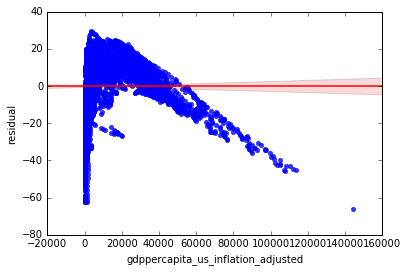

### Problem 2
### For Manvita Markala's visualization.(Link https://github.com/manvitamarkala/DS-5500---HW1). This visualization effectively show us the distribution of income across countries and also the trend of income’s growth by time. Mine is similar to this one, as we both used static line plot and denote different regions by color. I like the plot in which the author also make a visualization on countries level, which provide additional information, although it’s kind of hard to read those large number of lines in detail. Overall, I think the visualization is effective and easy to interpret.


### Problem 3
### For Nick Tyler’s visualization project. (Link https://github.com/tylernickr/DS5500/tree/master/hw1). This visualization is generated in R but is very similar to the one before and mine which are from python. We both use static line plots and the idea are pretty much the same. One thing to notice is Noah also add a bar plot to visualize distribution across region, which I think is a good idea as bar plot is easier to interpret as it has steady scale as measurement. The ordering of bars also provides an easy interpretation of the rank of incomes. Overall, I think the visualization is effective and easy to interpret.

### Problem 4,5


```python
import pandas as pd
import numpy as np
import matplotlib.pyplot as plt
import seaborn as sns
import sklearn
import sklearn.metrics
import statsmodels.api as sm
import statsmodels.formula.api as smf
from functools import reduce
from sklearn.linear_model import LinearRegression
%matplotlib inline 
```


```python


df_gdp = pd.read_csv('C:\\Users\\hudie\\Downloads\\ddf--datapoints--gdppercapita_us_inflation_adjusted--by--geo--time.csv')
df_life = pd.read_csv('C:\\Users\\hudie\\Downloads\\ddf--datapoints--life_expectancy_years--by--geo--time.csv')
df_geo = pd.read_csv('C:\\Users\\hudie\\Downloads\\ddf--entities--geo--country.csv')[['country', 'world_6region']]

#
df_final = pd.merge(df_gdp, df_life, on = ['geo', 'time']) 
df_final = pd.merge(df_final, df_geo[['country', 'world_6region']], left_on = 'geo', right_on = 'country')
df_final.head()

```


<div>
<style scoped>
    .dataframe tbody tr th:only-of-type {
        vertical-align: middle;
    }

    .dataframe tbody tr th {
        vertical-align: top;
    }

    .dataframe thead th {
        text-align: right;
    }
</style>
<table border="1" class="dataframe">
  <thead>
    <tr style="text-align: right;">
      <th></th>
      <th>geo</th>
      <th>time</th>
      <th>gdppercapita_us_inflation_adjusted</th>
      <th>life_expectancy_years</th>
      <th>country</th>
      <th>world_6region</th>
    </tr>
  </thead>
  <tbody>
    <tr>
      <th>0</th>
      <td>abw</td>
      <td>2010</td>
      <td>24271.94042</td>
      <td>75.06</td>
      <td>abw</td>
      <td>america</td>
    </tr>
    <tr>
      <th>1</th>
      <td>afg</td>
      <td>2002</td>
      <td>364.57057</td>
      <td>52.43</td>
      <td>afg</td>
      <td>south_asia</td>
    </tr>
    <tr>
      <th>2</th>
      <td>afg</td>
      <td>2003</td>
      <td>376.75871</td>
      <td>53.03</td>
      <td>afg</td>
      <td>south_asia</td>
    </tr>
    <tr>
      <th>3</th>
      <td>afg</td>
      <td>2004</td>
      <td>364.09544</td>
      <td>53.50</td>
      <td>afg</td>
      <td>south_asia</td>
    </tr>
    <tr>
      <th>4</th>
      <td>afg</td>
      <td>2005</td>
      <td>389.41636</td>
      <td>53.87</td>
      <td>afg</td>
      <td>south_asia</td>
    </tr>
  </tbody>
</table>
</div>


```python

```


```python
df_final['log_gdp'] = np.log(df_final.gdppercapita_us_inflation_adjusted)

```

## Fit linear regression model
### Life ~ GDP + Time
### Life ~ log(GDP) + Time


```python

X = df_final[['gdppercapita_us_inflation_adjusted', 'time']] 
y = df_final['life_expectancy_years']
## fit a OLS model with intercept on TV and Radio
X = sm.add_constant(X)
est = sm.OLS(y, X).fit()
est.summary()
```

    C:\Users\hudie\Anaconda3\lib\site-packages\numpy\core\fromnumeric.py:2223: FutureWarning: Method .ptp is deprecated and will be removed in a future version. Use numpy.ptp instead.
      return ptp(axis=axis, out=out, **kwargs)
    


<table class="simpletable">
<caption>OLS Regression Results</caption>
<tr>
  <th>Dep. Variable:</th>    <td>life_expectancy_years</td> <th>  R-squared:         </th> <td>   0.442</td> 
</tr>
<tr>
  <th>Model:</th>                     <td>OLS</td>          <th>  Adj. R-squared:    </th> <td>   0.442</td> 
</tr>
<tr>
  <th>Method:</th>               <td>Least Squares</td>     <th>  F-statistic:       </th> <td>   3444.</td> 
</tr>
<tr>
  <th>Date:</th>               <td>Mon, 28 Oct 2019</td>    <th>  Prob (F-statistic):</th>  <td>  0.00</td>  
</tr>
<tr>
  <th>Time:</th>                   <td>16:47:09</td>        <th>  Log-Likelihood:    </th> <td> -29849.</td> 
</tr>
<tr>
  <th>No. Observations:</th>        <td>  8709</td>         <th>  AIC:               </th> <td>5.970e+04</td>
</tr>
<tr>
  <th>Df Residuals:</th>            <td>  8706</td>         <th>  BIC:               </th> <td>5.973e+04</td>
</tr>
<tr>
  <th>Df Model:</th>                <td>     2</td>         <th>                     </th>     <td> </td>    
</tr>
<tr>
  <th>Covariance Type:</th>        <td>nonrobust</td>       <th>                     </th>     <td> </td>    
</tr>
</table>
<table class="simpletable">
<tr>
                   <td></td>                     <th>coef</th>     <th>std err</th>      <th>t</th>      <th>P>|t|</th>  <th>[0.025</th>    <th>0.975]</th>  
</tr>
<tr>
  <th>const</th>                              <td> -367.8300</td> <td>   10.116</td> <td>  -36.361</td> <td> 0.000</td> <td> -387.660</td> <td> -348.000</td>
</tr>
<tr>
  <th>gdppercapita_us_inflation_adjusted</th> <td>    0.0003</td> <td> 5.11e-06</td> <td>   63.537</td> <td> 0.000</td> <td>    0.000</td> <td>    0.000</td>
</tr>
<tr>
  <th>time</th>                               <td>    0.2161</td> <td>    0.005</td> <td>   42.535</td> <td> 0.000</td> <td>    0.206</td> <td>    0.226</td>
</tr>
</table>
<table class="simpletable">
<tr>
  <th>Omnibus:</th>       <td>603.579</td> <th>  Durbin-Watson:     </th> <td>   0.061</td> 
</tr>
<tr>
  <th>Prob(Omnibus):</th> <td> 0.000</td>  <th>  Jarque-Bera (JB):  </th> <td> 738.088</td> 
</tr>
<tr>
  <th>Skew:</th>          <td>-0.713</td>  <th>  Prob(JB):          </th> <td>5.32e-161</td>
</tr>
<tr>
  <th>Kurtosis:</th>      <td> 2.996</td>  <th>  Cond. No.          </th> <td>2.42e+06</td> 
</tr>
</table><br/><br/>Warnings:<br/>[1] Standard Errors assume that the covariance matrix of the errors is correctly specified.<br/>[2] The condition number is large, 2.42e+06. This might indicate that there are<br/>strong multicollinearity or other numerical problems.


```python
test_pred = est.predict(X)
mse = sklearn.metrics.mean_squared_error(test_pred, y)
print('model mse is: ' + str(mse))

#for residual plot
df_final['pred'] =  est.predict(X)
df_final['residual'] = df_final['pred'] - y
```

    model mse is: 55.52940620133212
    


```python
gdp_life_plot = sns.regplot("gdppercapita_us_inflation_adjusted", "life_expectancy_years", data = df_final,
                           scatter_kws={"color": "blue"}, line_kws={"color": "red"})
```

    C:\Users\hudie\Anaconda3\lib\site-packages\scipy\stats\stats.py:1713: FutureWarning: Using a non-tuple sequence for multidimensional indexing is deprecated; use `arr[tuple(seq)]` instead of `arr[seq]`. In the future this will be interpreted as an array index, `arr[np.array(seq)]`, which will result either in an error or a different result.
      return np.add.reduce(sorted[indexer] * weights, axis=axis) / sumval
    


```python
gdp_life_plot = sns.regplot("gdppercapita_us_inflation_adjusted", "residual", data = df_final,
                           scatter_kws={"color": "blue"}, line_kws={"color": "red"})
```

    C:\Users\hudie\Anaconda3\lib\site-packages\scipy\stats\stats.py:1713: FutureWarning: Using a non-tuple sequence for multidimensional indexing is deprecated; use `arr[tuple(seq)]` instead of `arr[seq]`. In the future this will be interpreted as an array index, `arr[np.array(seq)]`, which will result either in an error or a different result.
      return np.add.reduce(sorted[indexer] * weights, axis=axis) / sumval
    


```python

```


```python
df_final['log_gdp'] = np.log(df_final.gdppercapita_us_inflation_adjusted)
X = df_final[['log_gdp', 'time']] 
y = df_final['life_expectancy_years']
## fit a OLS model with intercept on TV and Radio
X = sm.add_constant(X)
est = sm.OLS(y, X).fit()
est.summary()
```

    C:\Users\hudie\Anaconda3\lib\site-packages\numpy\core\fromnumeric.py:2223: FutureWarning: Method .ptp is deprecated and will be removed in a future version. Use numpy.ptp instead.
      return ptp(axis=axis, out=out, **kwargs)
    


<table class="simpletable">
<caption>OLS Regression Results</caption>
<tr>
  <th>Dep. Variable:</th>    <td>life_expectancy_years</td> <th>  R-squared:         </th> <td>   0.703</td> 
</tr>
<tr>
  <th>Model:</th>                     <td>OLS</td>          <th>  Adj. R-squared:    </th> <td>   0.703</td> 
</tr>
<tr>
  <th>Method:</th>               <td>Least Squares</td>     <th>  F-statistic:       </th> <td>1.031e+04</td>
</tr>
<tr>
  <th>Date:</th>               <td>Mon, 28 Oct 2019</td>    <th>  Prob (F-statistic):</th>  <td>  0.00</td>  
</tr>
<tr>
  <th>Time:</th>                   <td>16:40:23</td>        <th>  Log-Likelihood:    </th> <td> -27099.</td> 
</tr>
<tr>
  <th>No. Observations:</th>        <td>  8709</td>         <th>  AIC:               </th> <td>5.420e+04</td>
</tr>
<tr>
  <th>Df Residuals:</th>            <td>  8706</td>         <th>  BIC:               </th> <td>5.422e+04</td>
</tr>
<tr>
  <th>Df Model:</th>                <td>     2</td>         <th>                     </th>     <td> </td>    
</tr>
<tr>
  <th>Covariance Type:</th>        <td>nonrobust</td>       <th>                     </th>     <td> </td>    
</tr>
</table>
<table class="simpletable">
<tr>
     <td></td>        <th>coef</th>     <th>std err</th>      <th>t</th>      <th>P>|t|</th>  <th>[0.025</th>    <th>0.975]</th>  
</tr>
<tr>
  <th>const</th>   <td> -351.2779</td> <td>    7.348</td> <td>  -47.805</td> <td> 0.000</td> <td> -365.682</td> <td> -336.874</td>
</tr>
<tr>
  <th>log_gdp</th> <td>    4.7872</td> <td>    0.039</td> <td>  123.526</td> <td> 0.000</td> <td>    4.711</td> <td>    4.863</td>
</tr>
<tr>
  <th>time</th>    <td>    0.1898</td> <td>    0.004</td> <td>   51.131</td> <td> 0.000</td> <td>    0.183</td> <td>    0.197</td>
</tr>
</table>
<table class="simpletable">
<tr>
  <th>Omnibus:</th>       <td>930.015</td> <th>  Durbin-Watson:     </th> <td>   0.076</td>
</tr>
<tr>
  <th>Prob(Omnibus):</th> <td> 0.000</td>  <th>  Jarque-Bera (JB):  </th> <td>1657.912</td>
</tr>
<tr>
  <th>Skew:</th>          <td>-0.729</td>  <th>  Prob(JB):          </th> <td>    0.00</td>
</tr>
<tr>
  <th>Kurtosis:</th>      <td> 4.564</td>  <th>  Cond. No.          </th> <td>2.51e+05</td>
</tr>
</table><br/><br/>Warnings:<br/>[1] Standard Errors assume that the covariance matrix of the errors is correctly specified.<br/>[2] The condition number is large, 2.51e+05. This might indicate that there are<br/>strong multicollinearity or other numerical problems.


```python
test_pred = est.predict(X)
mse = sklearn.metrics.mean_squared_error(test_pred, y)
print('model mse is: ' + str(mse))

df_final['pred'] =  est.predict(X)
df_final['residual'] = df_final['pred'] - y
```

    model mse is: 29.526962827478513
    


```python
gdp_life_plot = sns.regplot("log_gdp", "life_expectancy_years", data = df_final,
                           scatter_kws={"color": "blue"}, line_kws={"color": "red"})
```

    C:\Users\hudie\Anaconda3\lib\site-packages\scipy\stats\stats.py:1713: FutureWarning: Using a non-tuple sequence for multidimensional indexing is deprecated; use `arr[tuple(seq)]` instead of `arr[seq]`. In the future this will be interpreted as an array index, `arr[np.array(seq)]`, which will result either in an error or a different result.
      return np.add.reduce(sorted[indexer] * weights, axis=axis) / sumval
    


```python
gdp_life_plot = sns.regplot("log_gdp", "residual", data = df_final,
                           scatter_kws={"color": "blue"}, line_kws={"color": "red"})
```

    C:\Users\hudie\Anaconda3\lib\site-packages\scipy\stats\stats.py:1713: FutureWarning: Using a non-tuple sequence for multidimensional indexing is deprecated; use `arr[tuple(seq)]` instead of `arr[seq]`. In the future this will be interpreted as an array index, `arr[np.array(seq)]`, which will result either in an error or a different result.
      return np.add.reduce(sorted[indexer] * weights, axis=axis) / sumval
    


# Problem 5
## Fit linear regression model
### Children Mortality ~ GDP + Time
### Children Mortality ~ log(GDP) + Time


```python


df_gdp = pd.read_csv('C:\\Users\\hudie\\Downloads\\ddf--datapoints--gdppercapita_us_inflation_adjusted--by--geo--time.csv')
df_mortality=pd.read_csv("C:\\Users\\hudie\\Downloads\\ddf--datapoints--newborn_mortality_rate_per_1000--by--geo--time.csv")
df_geo = pd.read_csv('C:\\Users\\hudie\\Downloads\\ddf--entities--geo--country.csv')[['country', 'world_6region']]

#
df_final = pd.merge(df_gdp, df_mortality, on = ['geo', 'time']) 
df_final = pd.merge(df_final, df_geo[['country', 'world_6region']], left_on = 'geo', right_on = 'country')
df_final.head()
```


<div>
<style scoped>
    .dataframe tbody tr th:only-of-type {
        vertical-align: middle;
    }

    .dataframe tbody tr th {
        vertical-align: top;
    }

    .dataframe thead th {
        text-align: right;
    }
</style>
<table border="1" class="dataframe">
  <thead>
    <tr style="text-align: right;">
      <th></th>
      <th>geo</th>
      <th>time</th>
      <th>gdppercapita_us_inflation_adjusted</th>
      <th>newborn_mortality_rate_per_1000</th>
      <th>country</th>
      <th>world_6region</th>
    </tr>
  </thead>
  <tbody>
    <tr>
      <th>0</th>
      <td>afg</td>
      <td>2002</td>
      <td>364.57057</td>
      <td>43.9</td>
      <td>afg</td>
      <td>south_asia</td>
    </tr>
    <tr>
      <th>1</th>
      <td>afg</td>
      <td>2003</td>
      <td>376.75871</td>
      <td>43.2</td>
      <td>afg</td>
      <td>south_asia</td>
    </tr>
    <tr>
      <th>2</th>
      <td>afg</td>
      <td>2004</td>
      <td>364.09544</td>
      <td>42.5</td>
      <td>afg</td>
      <td>south_asia</td>
    </tr>
    <tr>
      <th>3</th>
      <td>afg</td>
      <td>2005</td>
      <td>389.41636</td>
      <td>41.7</td>
      <td>afg</td>
      <td>south_asia</td>
    </tr>
    <tr>
      <th>4</th>
      <td>afg</td>
      <td>2006</td>
      <td>397.98590</td>
      <td>41.0</td>
      <td>afg</td>
      <td>south_asia</td>
    </tr>
  </tbody>
</table>
</div>


```python

X = df_final[['gdppercapita_us_inflation_adjusted', 'time']] 
y = df_final['newborn_mortality_rate_per_1000']
## fit a OLS model with intercept on TV and Radio
X = sm.add_constant(X)
est = sm.OLS(y, X).fit()
est.summary()
```

    C:\Users\hudie\Anaconda3\lib\site-packages\numpy\core\fromnumeric.py:2223: FutureWarning: Method .ptp is deprecated and will be removed in a future version. Use numpy.ptp instead.
      return ptp(axis=axis, out=out, **kwargs)
    


<table class="simpletable">
<caption>OLS Regression Results</caption>
<tr>
  <th>Dep. Variable:</th>    <td>newborn_mortality_rate_per_1000</td> <th>  R-squared:         </th> <td>   0.441</td> 
</tr>
<tr>
  <th>Model:</th>                          <td>OLS</td>               <th>  Adj. R-squared:    </th> <td>   0.441</td> 
</tr>
<tr>
  <th>Method:</th>                    <td>Least Squares</td>          <th>  F-statistic:       </th> <td>   2880.</td> 
</tr>
<tr>
  <th>Date:</th>                    <td>Mon, 28 Oct 2019</td>         <th>  Prob (F-statistic):</th>  <td>  0.00</td>  
</tr>
<tr>
  <th>Time:</th>                        <td>17:02:42</td>             <th>  Log-Likelihood:    </th> <td> -29781.</td> 
</tr>
<tr>
  <th>No. Observations:</th>             <td>  7299</td>              <th>  AIC:               </th> <td>5.957e+04</td>
</tr>
<tr>
  <th>Df Residuals:</th>                 <td>  7296</td>              <th>  BIC:               </th> <td>5.959e+04</td>
</tr>
<tr>
  <th>Df Model:</th>                     <td>     2</td>              <th>                     </th>     <td> </td>    
</tr>
<tr>
  <th>Covariance Type:</th>             <td>nonrobust</td>            <th>                     </th>     <td> </td>    
</tr>
</table>
<table class="simpletable">
<tr>
                   <td></td>                     <th>coef</th>     <th>std err</th>      <th>t</th>      <th>P>|t|</th>  <th>[0.025</th>    <th>0.975]</th>  
</tr>
<tr>
  <th>const</th>                              <td> 1079.7559</td> <td>   23.352</td> <td>   46.238</td> <td> 0.000</td> <td> 1033.979</td> <td> 1125.533</td>
</tr>
<tr>
  <th>gdppercapita_us_inflation_adjusted</th> <td>   -0.0006</td> <td> 1.08e-05</td> <td>  -54.826</td> <td> 0.000</td> <td>   -0.001</td> <td>   -0.001</td>
</tr>
<tr>
  <th>time</th>                               <td>   -0.5263</td> <td>    0.012</td> <td>  -44.907</td> <td> 0.000</td> <td>   -0.549</td> <td>   -0.503</td>
</tr>
</table>
<table class="simpletable">
<tr>
  <th>Omnibus:</th>       <td>993.933</td> <th>  Durbin-Watson:     </th> <td>   0.066</td>
</tr>
<tr>
  <th>Prob(Omnibus):</th> <td> 0.000</td>  <th>  Jarque-Bera (JB):  </th> <td>1522.475</td>
</tr>
<tr>
  <th>Skew:</th>          <td> 0.973</td>  <th>  Prob(JB):          </th> <td>    0.00</td>
</tr>
<tr>
  <th>Kurtosis:</th>      <td> 4.105</td>  <th>  Cond. No.          </th> <td>2.61e+06</td>
</tr>
</table><br/><br/>Warnings:<br/>[1] Standard Errors assume that the covariance matrix of the errors is correctly specified.<br/>[2] The condition number is large, 2.61e+06. This might indicate that there are<br/>strong multicollinearity or other numerical problems.


```python
test_pred = est.predict(X)
mse = sklearn.metrics.mean_squared_error(test_pred, y)
print('model mse is: ' + str(mse))

#for residual plot
df_final['pred'] =  est.predict(X)
df_final['residual'] = df_final['pred'] - y
```

    model mse is: 204.87848161080203
    


```python
gdp_life_plot = sns.regplot("gdppercapita_us_inflation_adjusted", "newborn_mortality_rate_per_1000", data = df_final,
                           scatter_kws={"color": "blue"}, line_kws={"color": "red"})
```

    C:\Users\hudie\Anaconda3\lib\site-packages\scipy\stats\stats.py:1713: FutureWarning: Using a non-tuple sequence for multidimensional indexing is deprecated; use `arr[tuple(seq)]` instead of `arr[seq]`. In the future this will be interpreted as an array index, `arr[np.array(seq)]`, which will result either in an error or a different result.
      return np.add.reduce(sorted[indexer] * weights, axis=axis) / sumval
    


```python
gdp_life_plot = sns.regplot("gdppercapita_us_inflation_adjusted", "residual", data = df_final,
                           scatter_kws={"color": "blue"}, line_kws={"color": "red"})
```

    C:\Users\hudie\Anaconda3\lib\site-packages\scipy\stats\stats.py:1713: FutureWarning: Using a non-tuple sequence for multidimensional indexing is deprecated; use `arr[tuple(seq)]` instead of `arr[seq]`. In the future this will be interpreted as an array index, `arr[np.array(seq)]`, which will result either in an error or a different result.
      return np.add.reduce(sorted[indexer] * weights, axis=axis) / sumval
    





```python
df_final['log_gdp'] = np.log(df_final.gdppercapita_us_inflation_adjusted)

X = df_final[['log_gdp', 'time']] 
y = df_final['newborn_mortality_rate_per_1000']
## fit a OLS model with intercept on TV and Radio
X = sm.add_constant(X)
est = sm.OLS(y, X).fit()
est.summary()
```

    C:\Users\hudie\Anaconda3\lib\site-packages\numpy\core\fromnumeric.py:2223: FutureWarning: Method .ptp is deprecated and will be removed in a future version. Use numpy.ptp instead.
      return ptp(axis=axis, out=out, **kwargs)
    


<table class="simpletable">
<caption>OLS Regression Results</caption>
<tr>
  <th>Dep. Variable:</th>    <td>newborn_mortality_rate_per_1000</td> <th>  R-squared:         </th> <td>   0.705</td> 
</tr>
<tr>
  <th>Model:</th>                          <td>OLS</td>               <th>  Adj. R-squared:    </th> <td>   0.705</td> 
</tr>
<tr>
  <th>Method:</th>                    <td>Least Squares</td>          <th>  F-statistic:       </th> <td>   8711.</td> 
</tr>
<tr>
  <th>Date:</th>                    <td>Mon, 28 Oct 2019</td>         <th>  Prob (F-statistic):</th>  <td>  0.00</td>  
</tr>
<tr>
  <th>Time:</th>                        <td>17:07:28</td>             <th>  Log-Likelihood:    </th> <td> -27452.</td> 
</tr>
<tr>
  <th>No. Observations:</th>             <td>  7299</td>              <th>  AIC:               </th> <td>5.491e+04</td>
</tr>
<tr>
  <th>Df Residuals:</th>                 <td>  7296</td>              <th>  BIC:               </th> <td>5.493e+04</td>
</tr>
<tr>
  <th>Df Model:</th>                     <td>     2</td>              <th>                     </th>     <td> </td>    
</tr>
<tr>
  <th>Covariance Type:</th>             <td>nonrobust</td>            <th>                     </th>     <td> </td>    
</tr>
</table>
<table class="simpletable">
<tr>
     <td></td>        <th>coef</th>     <th>std err</th>      <th>t</th>      <th>P>|t|</th>  <th>[0.025</th>    <th>0.975]</th>  
</tr>
<tr>
  <th>const</th>   <td> 1063.0710</td> <td>   16.914</td> <td>   62.851</td> <td> 0.000</td> <td> 1029.914</td> <td> 1096.228</td>
</tr>
<tr>
  <th>log_gdp</th> <td>   -9.0258</td> <td>    0.082</td> <td> -110.488</td> <td> 0.000</td> <td>   -9.186</td> <td>   -8.866</td>
</tr>
<tr>
  <th>time</th>    <td>   -0.4838</td> <td>    0.009</td> <td>  -56.774</td> <td> 0.000</td> <td>   -0.501</td> <td>   -0.467</td>
</tr>
</table>
<table class="simpletable">
<tr>
  <th>Omnibus:</th>       <td>1245.000</td> <th>  Durbin-Watson:     </th> <td>   0.075</td>
</tr>
<tr>
  <th>Prob(Omnibus):</th>  <td> 0.000</td>  <th>  Jarque-Bera (JB):  </th> <td>2943.863</td>
</tr>
<tr>
  <th>Skew:</th>           <td> 0.967</td>  <th>  Prob(JB):          </th> <td>    0.00</td>
</tr>
<tr>
  <th>Kurtosis:</th>       <td> 5.436</td>  <th>  Cond. No.          </th> <td>2.77e+05</td>
</tr>
</table><br/><br/>Warnings:<br/>[1] Standard Errors assume that the covariance matrix of the errors is correctly specified.<br/>[2] The condition number is large, 2.77e+05. This might indicate that there are<br/>strong multicollinearity or other numerical problems.


```python
test_pred = est.predict(X)
mse = sklearn.metrics.mean_squared_error(test_pred, y)
print('model mse is: ' + str(mse))

#for residual plot
df_final['pred'] =  est.predict(X)
df_final['residual'] = df_final['pred'] - y
```

    model mse is: 108.21742761709987
    


```python
gdp_life_plot = sns.regplot("log_gdp", "log_mort", data = df_final,
                           scatter_kws={"color": "blue"}, line_kws={"color": "red"})
```

    C:\Users\hudie\Anaconda3\lib\site-packages\scipy\stats\stats.py:1713: FutureWarning: Using a non-tuple sequence for multidimensional indexing is deprecated; use `arr[tuple(seq)]` instead of `arr[seq]`. In the future this will be interpreted as an array index, `arr[np.array(seq)]`, which will result either in an error or a different result.
      return np.add.reduce(sorted[indexer] * weights, axis=axis) / sumval
    


```python
gdp_life_plot = sns.regplot("log_gdp", "residual", data = df_final,
                           scatter_kws={"color": "blue"}, line_kws={"color": "red"})
```

    C:\Users\hudie\Anaconda3\lib\site-packages\scipy\stats\stats.py:1713: FutureWarning: Using a non-tuple sequence for multidimensional indexing is deprecated; use `arr[tuple(seq)]` instead of `arr[seq]`. In the future this will be interpreted as an array index, `arr[np.array(seq)]`, which will result either in an error or a different result.
      return np.add.reduce(sorted[indexer] * weights, axis=axis) / sumval
    


```python

```


```python

```
